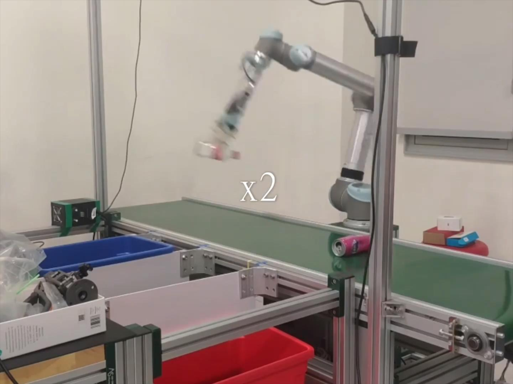

# ME336 Yellow Team

Project source code for ME336 Collaborative Robot Learning

## A Garbage Sorting System Based on Visual Recognition and Robot Arm

**Projects:**
* [Project 1 : 2D Picking](README_PROJECT_1.md)
* [Project 2 : 6D Picking](README_PROJECT_2.md)
* [Project 3 : Agile Waste Sorting with Tossing](/projects/ME336_Report.pdf)

## Demo Video

[demo](https://github.com/silvery107/silvery107.github.io/raw/main/assets/img/tossing-video-4-3.mp4)

