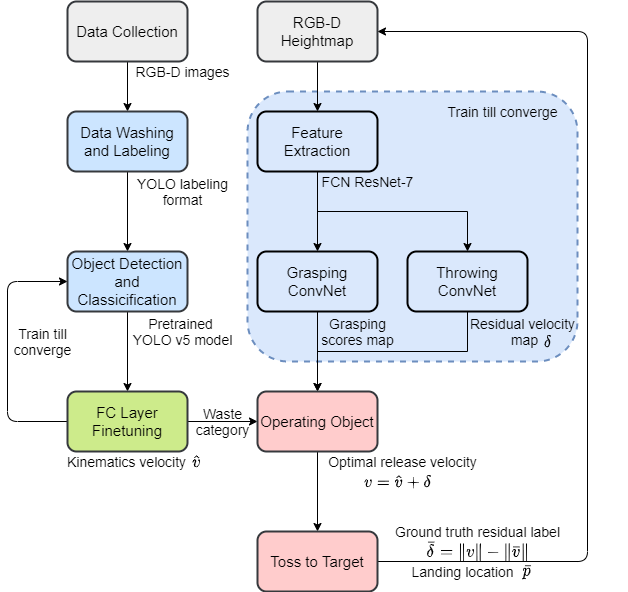

# Waste Sorting with Robot Arm Tossing

Project source code for ME336 Collaborative Robot Learning

## A Garbage Sorting System Based on Visual Recognition and Robot Arm

**Projects:**
* [Project 1 : 2D Picking](README_PROJECT_1.md)
* [Project 2 : 6D Picking](README_PROJECT_2.md)
* [Project 3 : Agile Waste Sorting with Tossing](/projects/ME336_Report.pdf)

## Demo Video

https://user-images.githubusercontent.com/44640904/185954403-b1a46d5d-f8ff-4a3d-b9fa-c7c05c72230f.mp4

